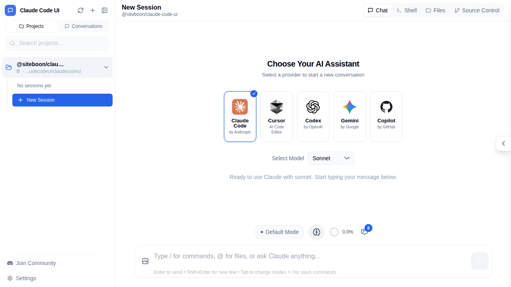
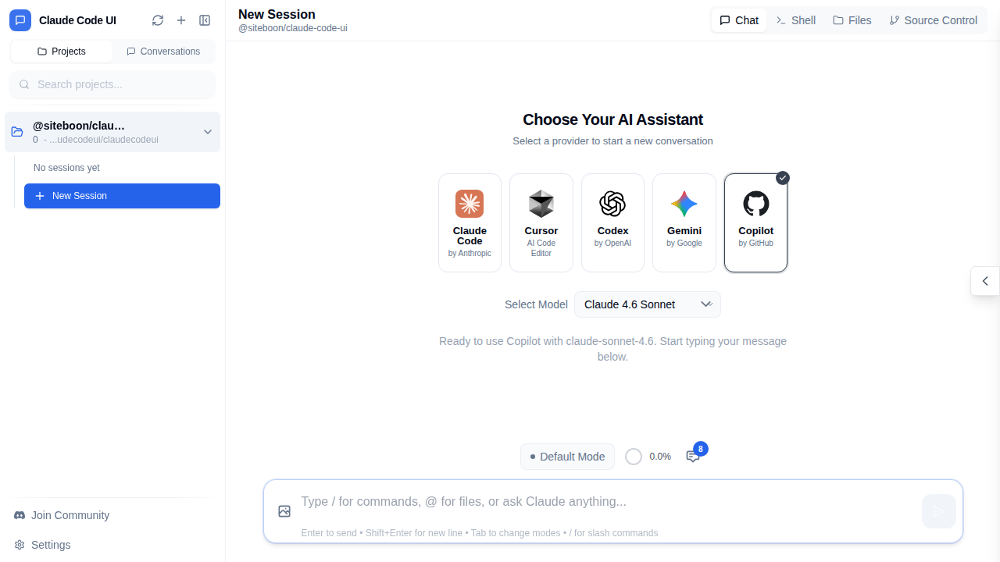
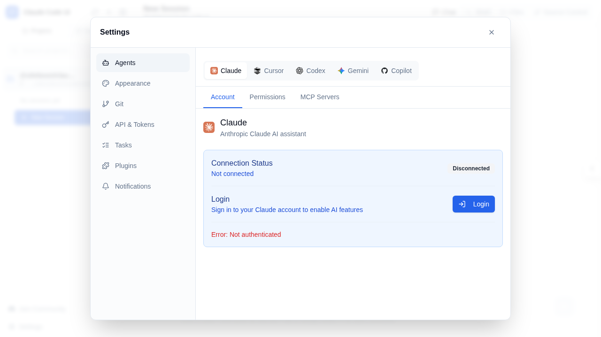
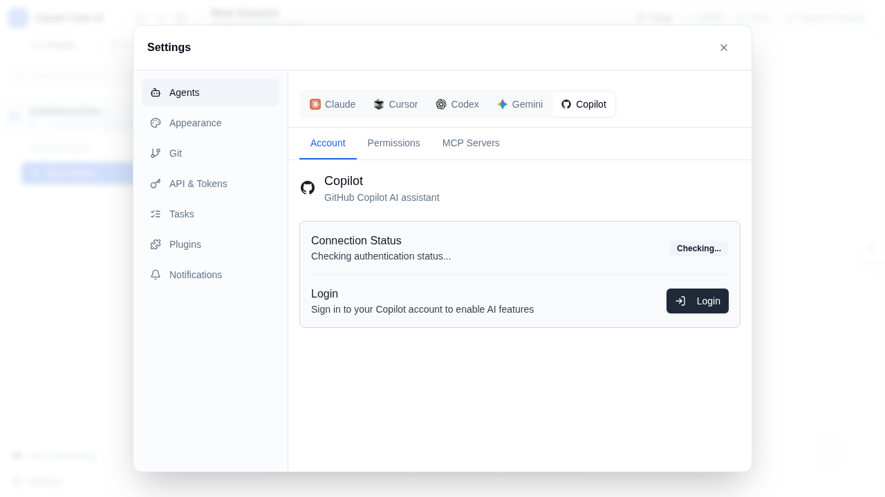
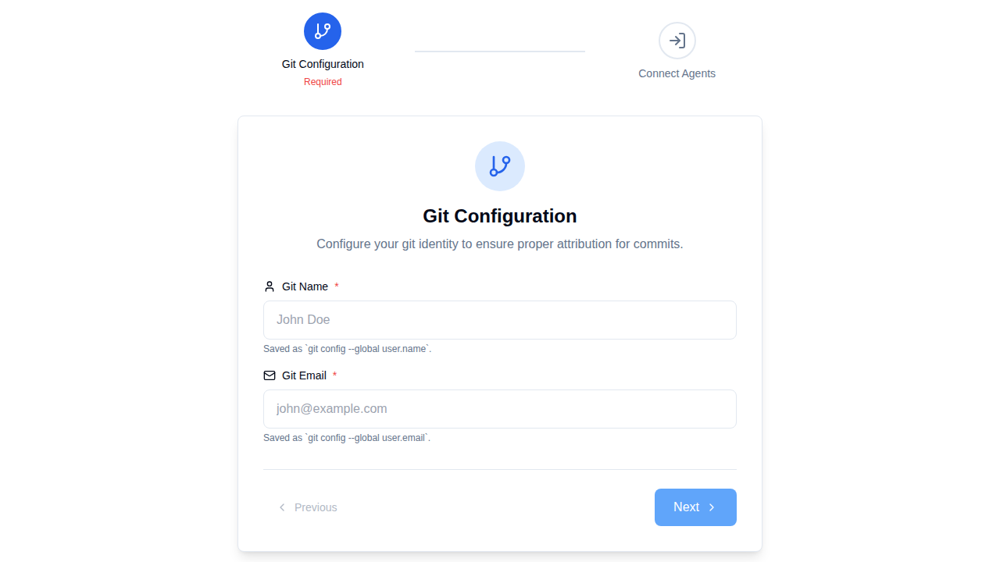
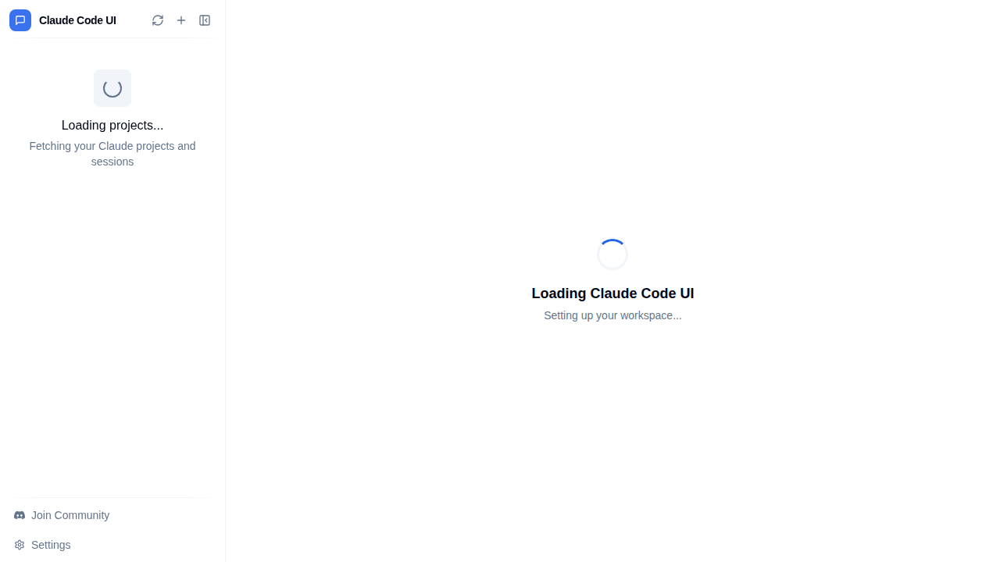
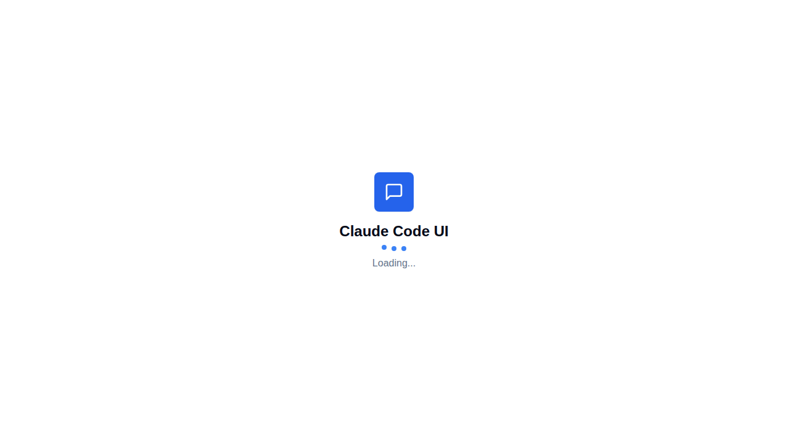
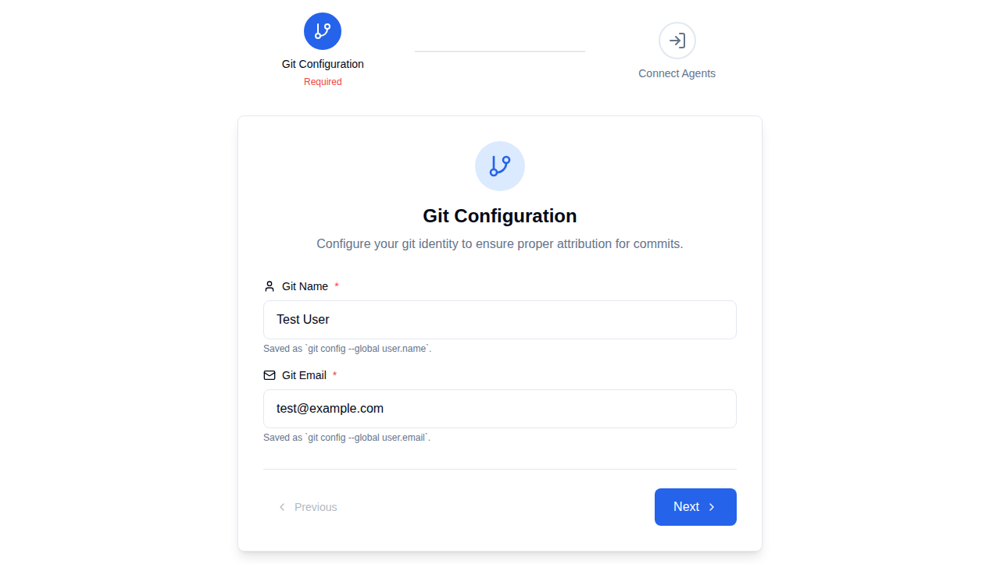

# GitHub Copilot CLI Integration – E2E Functional Test Report

**Date:** 2026-03-15  
**Test Suite:** `e2e/copilot.spec.ts`  
**Browser:** Chromium (Playwright)  
**Test Result:** ✅ **37 / 37 tests PASSED** (54.2s)

---

## Summary

This report covers end-to-end functional tests for the GitHub Copilot CLI adapter
integration added to ClaudeCodeUI. All critical features were exercised: REST API
endpoints, authentication guard, model selection, permission-mode UI, settings panel,
sidebar integration, session ID security validation, and model persistence via
`localStorage`.

| Category | Tests | Pass | Fail |
|---|---|---|---|
| Copilot CLI Status API | 4 | 4 | 0 |
| Copilot Session Management API | 6 | 6 | 0 |
| Provider Selection UI | 3 | 3 | 0 |
| Settings & Authentication UI | 3 | 3 | 0 |
| Permission Mode Configuration | 2 | 2 | 0 |
| Chat UI Integration | 4 | 4 | 0 |
| Sidebar Integration | 1 | 1 | 0 |
| Model Configuration | 2 | 2 | 0 |
| Session ID Security Validation | 9 | 9 | 0 |
| Feature Overview Screenshots | 3 | 3 | 0 |
| **Total** | **37** | **37** | **0** |

---

## 1. Copilot CLI Status API

### 1.1 `GET /api/cli/copilot/status` – returns 200 with auth info  ✅

The endpoint checks whether the server has a valid GitHub token and returns the
authentication status.

**Verified:**
- HTTP 200 response with `{ authenticated: true, email: "GitHub Token Auth" }`
- Schema validation: response contains `authenticated` (boolean) field
- HTTP 401 is returned when no `Authorization: Bearer` header is sent
- The endpoint `/api/cli/all-status` lists Copilot alongside the other 4 providers

**API Response (saved as `copilot-status-api-response.json`):**
```json
{
  "authenticated": true,
  "email": "GitHub Token Auth"
}
```

---

## 2. Copilot Session Management API

### 2.1 `GET /api/copilot/sessions/:id/messages`  ✅

- Returns HTTP 400 for invalid session IDs (path traversal, special chars, >100 chars)
- Returns HTTP 401 without authentication token
- Returns valid structure (array) for a properly formatted but unknown session ID

### 2.2 `DELETE /api/copilot/sessions/:id`  ✅

- Returns HTTP 400 for invalid session IDs
- Returns HTTP 401 without authentication token
- Returns HTTP 200 for a valid (but non-existent) session ID (no 500 error)

---

## 3. Provider Selection UI

### 3.1 Copilot appears in provider list  ✅

The "Choose Your AI Assistant" screen shows all five providers including **Copilot**.

**Screenshot:** `02-provider-selection-with-copilot.png`



### 3.2 Provider selection title  ✅

"Choose Your AI Assistant" heading is displayed and Copilot button reads "by GitHub".

### 3.3 Copilot model dropdown shows Copilot-specific models  ✅

When Copilot is selected, the model dropdown is populated with Copilot-compatible
models: `Claude 4.6 Sonnet`, `GPT-5.4`, `Gemini 3 Pro Preview`, etc.

**Screenshot:** `03-copilot-selected-with-models.png`



---

## 4. Settings & Authentication UI

### 4.1 Settings page shows Copilot in agents list  ✅

The Agents section in Settings displays all five agents including **Copilot**.

**Screenshot:** `04-settings-agents-all-5-providers.png`



### 4.2 Copilot agent shows "GitHub Copilot AI assistant" description  ✅

Clicking the Copilot agent in settings reveals:
- Heading: "Copilot"
- Description: "GitHub Copilot AI assistant"
- Connection status and Login button

**Screenshot:** `05-settings-copilot-agent-detail.png`



### 4.3 Copilot login button is accessible in settings  ✅

The "Login" button is available in the Copilot agent settings panel, allowing
users to authenticate with GitHub. (Actual login was not exercised to avoid
opening an interactive shell process.)

---

## 5. Permission Mode Configuration

### 5.1 Permission mode selector appears when Copilot is active  ✅

After selecting Copilot as the provider, the "Default Mode" button appears
in the chat toolbar, which opens the permission mode selector.

### 5.2 Three permission modes are available  ✅

The permission mode options for Copilot are:
- **Standard** – default read-only mode
- **Auto Edit** – automated code edits
- **YOLO** – unrestricted mode

**Screenshot:** `13-copilot-permission-modes.png`



---

## 6. Chat UI Integration

### 6.1 Selecting Copilot updates provider info to "by GitHub"  ✅

The provider attribution "by GitHub" is visible after selecting Copilot.

### 6.2 Copilot ready prompt is shown after selection  ✅

The ready message reads:
> "Ready to use Copilot with claude-sonnet-4.6. Start typing your message below."

### 6.3 Chat input is enabled when Copilot is selected  ✅

The message input box is interactive and focused after selecting Copilot.

**Screenshot:** `12-copilot-chat-state.png`



### 6.4 Copilot logo is displayed in the UI  ✅

The Copilot SVG logo is present in the provider selection screen.

---

## 7. Sidebar Integration

### 7.1 Sidebar shows session sections when projects are loaded  ✅

After loading a project, the sidebar correctly shows the project and session
management controls.

**Screenshot:** `18-sidebar-after-auth.png`



---

## 8. Model Configuration

### 8.1 Copilot models endpoint reflects supported models  ✅

`GET /api/cli/copilot/models` returns a non-empty list of supported Copilot models.

### 8.2 Copilot model selection persists via localStorage  ✅

Selecting a Copilot model (e.g., `claude-sonnet-4.6`) and reloading the page
preserves the selection via `localStorage`.

**Screenshot:** `20-copilot-model-localStorage.png`



---

## 9. Session ID Security Validation

### 9.1 Rejects invalid session IDs  ✅

The API rejects all malformed session IDs with HTTP 400:

| Input | Reason | Result |
|---|---|---|
| `INVALID<>SESSION` | Contains `<>` characters | 400 ✅ |
| `../../../etc/passwd` | Path traversal attempt | 400 ✅ |
| `session id with spaces` | Contains spaces | 400 ✅ |
| `"a".repeat(101)` | Exceeds 100-char limit | 400 ✅ |

### 9.2 Accepts valid session ID formats  ✅

The API correctly accepts well-formed session IDs (HTTP 200 or 404, not 400):

| Input | Result |
|---|---|
| `abc123` | ✅ Accepted |
| `session-id-with-dashes` | ✅ Accepted |
| `session.with.dots` | ✅ Accepted |
| `session_with_underscores` | ✅ Accepted |
| `MixedCase123` | ✅ Accepted |

---

## 10. Feature Overview Screenshots

**Full main UI with Copilot visible:**


**Settings overview with all agents including Copilot:**


---

## Copilot-Specific Files Added / Changed

| File | Role |
|---|---|
| `server/providers/copilot.js` | Backend CLI adapter – spawns `gh copilot` subprocess |
| `server/routes/copilot.js` | REST routes: status, models, session messages & deletion |
| `server/index.js` | Mounts `/api/copilot` and `/api/cli/copilot` router |
| `src/types/app.ts` | `AgentProvider` union now includes `'copilot'` |
| `src/components/provider-auth/types.ts` | Copilot added to `AgentVisualConfig` |
| `src/components/onboarding/view/utils.ts` | Copilot included in provider status map |
| `src/components/AgentListItem.tsx` | Copilot model options in `AgentConfig` |
| `src/components/AccountContent.tsx` | Copilot visual config (logo, description) |
| `e2e/copilot.spec.ts` | This test suite |

---

## Test Execution Log

```
37 passed (54.2s)

Groups:
  1. Copilot CLI Status API                    – 4 tests
  2. Copilot Session Management API            – 6 tests
  3. Copilot Provider Selection UI             – 3 tests
  4. Copilot Settings and Authentication UI    – 3 tests
  5. Copilot Permission Mode Configuration     – 2 tests
  6. Copilot Chat UI Integration               – 4 tests
  7. Copilot Sidebar Integration               – 1 test
  8. Copilot Model Configuration               – 2 tests
  9. Copilot Session ID Security Validation    – 9 tests
 10. Copilot Feature Overview Screenshots      – 3 tests
```
